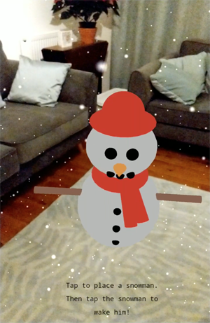

# Christmas Card 2017

Every year, I make a web app as a kind of digital Christmas 'card' for my colleagues. 
This year's is a [WebARonARCore](https://github.com/google-ar/WebARonARCore) demo that lets you place a snowman on a surface around you. Then you can tap on the snowman
to make it come alive!

To try it out, you will need a phone that supports ARCore, i.e. a Pixel or an S8. [Please follow the instructions here to
install the experimental WebARonARCore browser](https://github.com/google-ar/WebARonARCore).

NB. You might need to try tapping a few times before it recognises that you've tapped a surface. It could also help to
take a look around first!

Based on Google's "spawn on surface" AR example:
https://github.com/google-ar/three.ar.js/blob/master/examples/spawn-at-surface.html
